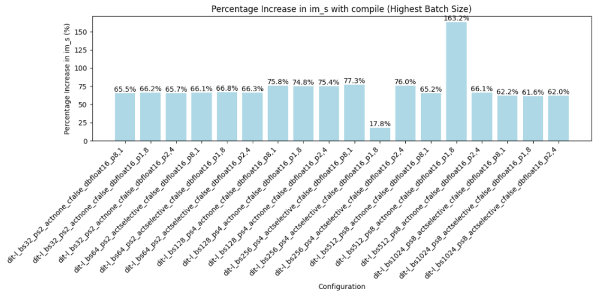
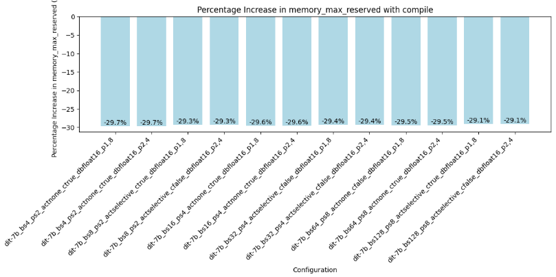
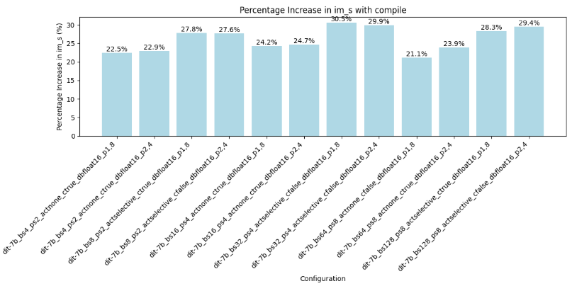
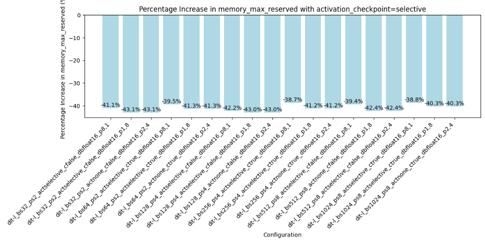
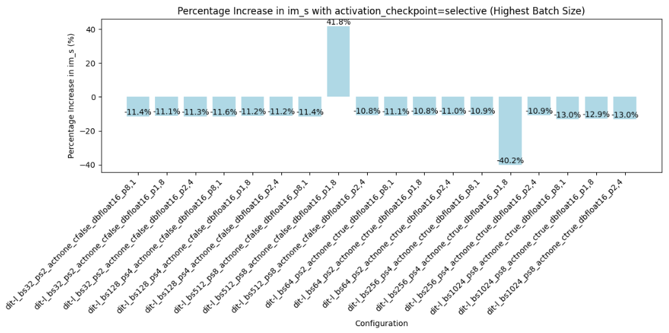
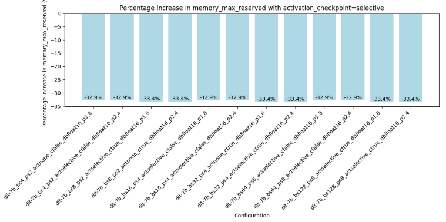
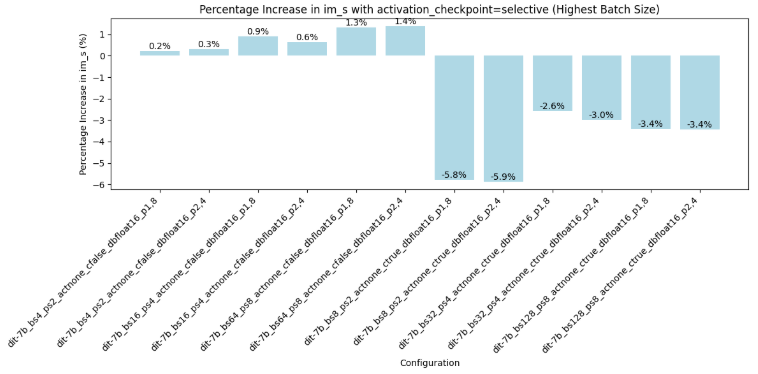
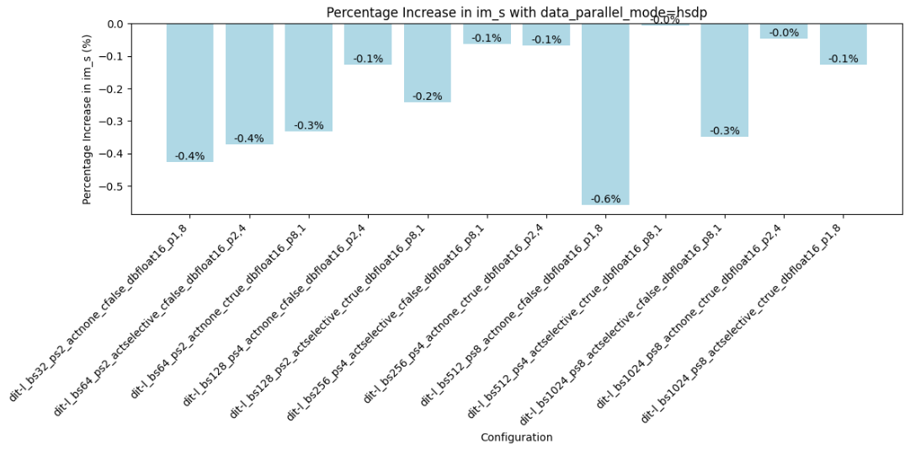
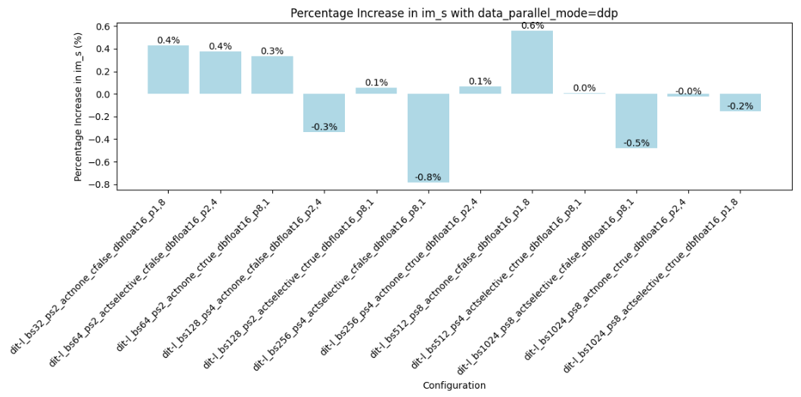
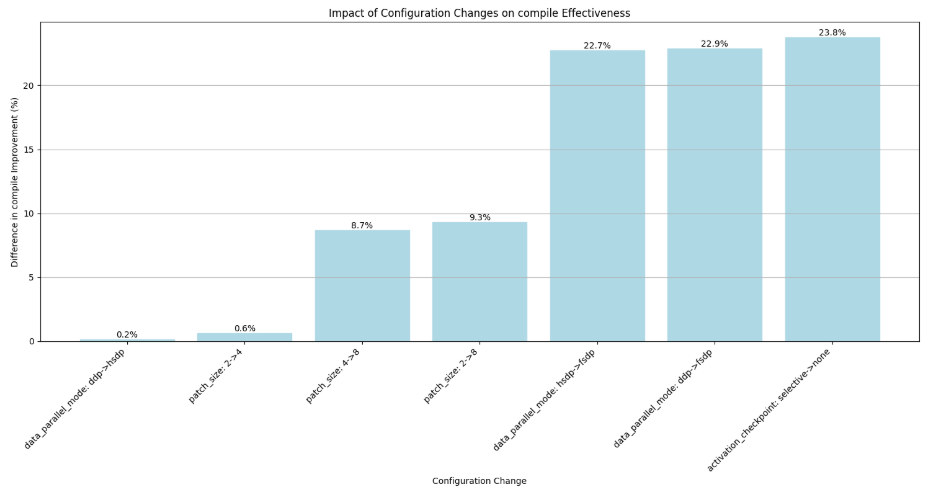

# torchditan
### COMS 6998 final project by Alper Canberk, Vaibhav Sourirajan, Shreya Somaluja.


> For the original TorchTitan repository and README, which this repository is based on, please see [here](https://github.com/pytorch/torchtitan).

> *Note to COMS 6998 teaching staff*: All of the code appears to be commited by Alper, this is because our group used a common machine to work on the project.

We present TorchDiTan, a fork of Meta's TorchTitan, adapted to support large-scale, efficient pre-training of diffusion transformers (DiTs). Building on TorchTitan’s minimal and hackable nature and recent developments in DiT architecture, we integrate features for distributed training of diffusion transformers in PyTorch. Our approach introduces key enhancements to the TorchTitan codebase for diffusion modeling, including modifications to data loaders for vision datasets, swapping components of the transformer architecture (e.g. 2D rotary embeddings, non-causal attention, patchification operations), and augmenting the training pipeline (eg. progressive sampling, mixed precision, and MFU calculations). We profile various optimizations such as data/model parallelism, torch.compile, and activation checkpointing, to ensure scalability and performance.


<div style="display: flex; flex-direction: row; gap: 10px;">
    
    
    
    
</div>

## Configuration and Training 

How to start

```bash
pip install --upgrade torch torchvision 
pip install torchvision wandb matplotlib==3.9.2 tqdm scipy torchdata sentencepiece tiktoken datasets tensorboard blobfile torchvision safetensors gpustat torchao
git clone https://github.com/NVIDIA/Cosmos-Tokenizer.git
cd Cosmos-Tokenizer
pip install -e .
cd ..
```

The entry point to our code is `scripts/train_latent_diffusion.sh`, which calls the `train.py` script with the appropriate arguments. By default, this script will use the `/train_configs/llama3_latent_diffusion.toml` configuration file, which trains a 0.5B DiT model on `ImageNet` on a single GPU.

## Repository Structure


### Core Training
- `train.py` - Main training script containing the training loop logic
- `torchtitan/samplers.py` - Handles image generation/sampling during training

### Configuration
- `torchtitan/config_manager.py` - Configuration management
- `/train_configs/*.toml` - Configuration files

### Model Components
- `torchtitan/models/llama/diffusion_blocks.py` - Core DiT components
- `torchtitan/models/llama/diffusion_model.py` - DiT model implementation
- `cosmos_latent_decoder.py` - Latent decoder implementation. Downloads the model from Hugging Face.

### Training Optimization
- `torchtitan/parallelisms/parallelize_llama.py` - Parallelization implementation
- `torchtitan/parallelisms/parallel_dims.py` - Parallel dimensions handling

### Data Loading
- `data/cifar10.py` - CIFAR-10 dataset loader
- `data/imagenet.py` - ImageNet dataset loader

## Benchmarking

Our results are benchmarked on 8XA100 SXM 80GB GPUs. To obtain the results obtained in the paper, please run the `scripts/run_ablations_7B.sh` and `scripts/run_ablations_0.5B.sh` scripts.

While these scripts grid search over batch size, if you would like to run experiments only using maximum batch size, you may look at `scripts/run_ablations_7B_autotune.sh`, which initially tunes the batch size for each GPU using a combination of heuristics and binary search.

These scripts will generate a directory under `outputs/` with the name of the experiment, the results of which you can plot using the `optimization_analysis.py` script.

## Benchmarking Results


Using `scripts/run_ablations_7B.sh` and `scripts/run_ablations_0.5B.sh`, we conduct a grid search over the following parameters to benchmark the efficiency of our implementations:
- Automatic mixed precision
- Parallelism strategy (ddp, fsdp, hsdp)
- Model sizes (0.5B, 7B)
- Batch sizes (1,2,...,1024)
- Activation checkpointing
- torch.compile


Our benchmarking strategy involves constructing a dummy data loader which loaded a (64×64×16) tensor of black (latent) images. We train on this dummy batch for 50 steps and average the following metrics from the last 10 steps:
- Percentage mean flop utilization (MFU %)
- Total images per second (im/s)
- Peak GPU memory

Prior to our ablation study, as a sanity check for our modified MFU and throughput calculations, we explore the relationship between our calculated metrics and batch size to ensure that throughput, MFU, and GPU memory usage all increase monotonically with an increased batch size.

In all our graphs, we use the following naming format:
```
dit_l_bs<batch-size>ps<patch-size>_act<activation-checkpointing-setting>_c<torch.compile setting><mixed precision param setting>p<replicate degree><shard degree>
```

Key findings:

1. **torch.compile Performance**:
   - 70% increase in throughput for 0.5B DiT
   - 25% increase for 7B DiT
   - 37% decrease in maximum memory utilization for 0.5B DiT
   - 29% decrease in memory for 7B DiT
   - Notable spike (163% increase) in throughput for specific configuration (bs512, ps8)



*Effects of torch.compile on Memory Managed and Throughput (0.5B DiT)*



*Effects of torch.compile on Memory Managed and Throughput (7B DiT)*

2. **Activation Checkpointing**:
   - Selective activation checkpointing reduces memory usage by 40% (0.5B) and 33% (7B)
   - No significant throughput improvements except in select 7B configurations
   - Slows down torch.compile performance



*Effects of Activation Checkpointing on Memory Managed and Throughput (0.5B DiT)*



*Effects of Activation Checkpointing on Memory Managed and Throughput (7B DiT)*

3. **Model Parallelism**:
   - Higher throughput observed with less sharding
   - DDP resulted in OOM errors for all 7B DiT ablations



*0.5B DiT Increase in Throughput With FSDP, HSDP, and DDP parallel modes*


*7B DiT Increase in Throughput With HSDP and FSDP parallel modes*

Configuration Impact on Compile Performance:



*Effects of configuration changes on torch.compile improvement*
